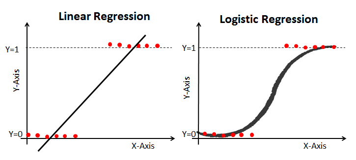

# Supervised Machine Learning Homework - Predicting Credit Risk

This task will be building a machine learning model that attempts to predict whether a loan from LendingClub will become high risk or not. 

## Background

LendingClub is a peer-to-peer lending services company that allows individual investors to partially fund personal loans, as well as buy and sell notes backing the loans on a secondary market. LendingClub offers their previous data through an API.

The data from LendingClub loans will be used to create machine learning models to classify the risk level of given loans. This task will compare the Logistic Regression model and Random Forest Classifier.

## Datasets

The loan datasets are located in the [/Resources](Resources/) directory.

## Jupyter notebook code

The code and analysis is located in the main directory and the filenane is Credit Risk Evaluator.ipynb

## Preprocessing: Convert categorical data to numeric

* The training dataset has been created from the 2019 loans using `pd.get_dummies()` to convert the categorical data to numeric columns. 
* The same is done for 2020 loans, also using `pd.get_dummies(). 
* Missing categories were added into the testing set.

## Logistic Regression Model

## Random Forest Model

## Scale the data

The Preprocessing data has been revisted and `StandardScaler` has been applied to scale the training and testing sets. 
The LogisticRegression and RandomForestClassifier models have been fitted and scored using the scaled data. 

### References

LendingClub (2019-2020) _Loan Stats_. Retrieved from: [https://resources.lendingclub.com/](https://resources.lendingclub.com/)

